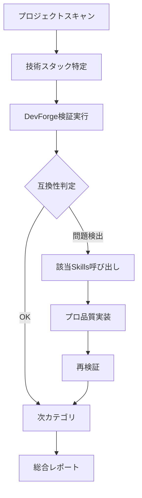
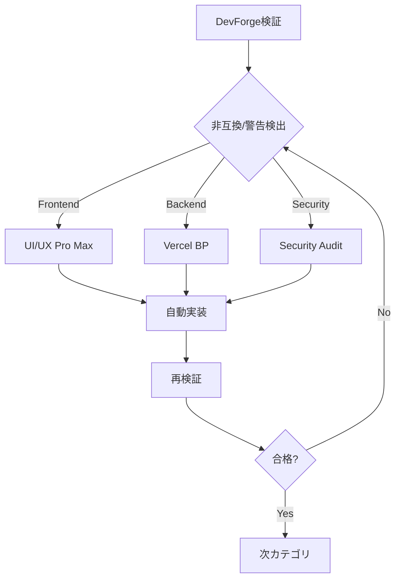

# DevForge v9 × Claude Code Skills 完全開発ガイド
## 技術互換性からビジネス成長まで：AI駆動型プロフェッショナル開発の全て

**バージョン**: v9.0 (Round 28) + Skills Integration  
**最終更新**: 2026年2月12日  
**作成者**: にしあん  
**対象**: エンジニアリングのタネプロジェクト & 一般プロジェクト

---

## 📚 目次

### Part 1: DevForge v9 - 技術互換性検証システム
1. [DevForge v9 概要](#devforge-v9-概要)
2. [技術互換性検証システム](#技術互換性検証システム)
3. [9カテゴリ詳細仕様](#9カテゴリ詳細仕様)
4. [35ルール完全リスト](#35ルール完全リスト)
5. [Claude Code Skills実装](#claude-code-skills実装)

### Part 2: 公式Skills活用術 - プロフェッショナル開発加速
6. [Skills活用の戦略的意義](#skills活用の戦略的意義)
7. [5つの神スキル徹底解説](#5つの神スキル徹底解説)
8. [実践的な品質向上手法](#実践的な品質向上手法)
9. [ビジネス成長戦略](#ビジネス成長戦略)
10. [カスタムSkill開発](#カスタムskill開発)

### Part 3: 統合運用ガイド
11. [開発環境セットアップ](#開発環境セットアップ)
12. [実装手順とワークフロー](#実装手順とワークフロー)
13. [CI/CD統合](#cicd統合)
14. [トラブルシューティング](#トラブルシューティング)
15. [付録とリファレンス](#付録とリファレンス)

---

# Part 1: DevForge v9 - 技術互換性検証システム

## DevForge v9 概要

### プロジェクトビジョン

DevForge v9は、複雑化する現代のWeb技術スタックにおける互換性問題を体系的に検証・解決するための包括的フレームワークです。**Claude Code Skillsと組み合わせることで、技術的な健全性とビジネス成長を同時に実現します。**

### コアコンセプト

```
技術互換性 (DevForge) + プロフェッショナル実装 (Skills) = 市場競争力
```

### 主要機能

- ✅ **35ルールシステム**: 技術スタック間の互換性を35の検証項目でチェック
- ✅ **9カテゴリ分類**: 検証領域を9つの専門分野に体系化
- ✅ **自動検証エンジン**: Claude Code Skillsによる自動互換性チェック
- ✅ **継続的改善**: Roundベースの段階的品質向上
- ✅ **IDE統合**: Cursor IDE/VS Codeでのシームレス実行
- 🆕 **Skills統合**: 公式Skillsによるプロフェッショナル実装支援

### 技術スタック

```json
{
  "core": {
    "language": "TypeScript 5.x",
    "runtime": "Node.js 20.x LTS",
    "packageManager": "pnpm 8.x"
  },
  "ai": {
    "llm": "Claude Sonnet 4.5",
    "tool": "Claude Code",
    "ide": "Cursor IDE / VS Code",
    "skills": "skills.sh ecosystem"
  },
  "validation": {
    "categories": 9,
    "rules": 35,
    "round": 28
  }
}
```

---

## 技術互換性検証システム

### システム構成

#### 3層アーキテクチャ + Skills統合

```
Layer 1: Description Layer (軽量メタデータ)
  ↓ 関連性判定
Layer 2: Core Rules Layer (検証ルール本体)
  ↓ 詳細検証必要時
Layer 3: Reference Layer (参照資料・スクリプト)
  ↓ プロフェッショナル実装
[Skills Layer]: 公式Skillsによる実装支援
```

### 検証 + 実装フロー



### 判定基準

| レベル | 記号 | 説明 | DevForgeアクション | Skillsアクション |
|--------|------|------|-------------------|-----------------|
| **Pass** | ✅ | 互換性OK | なし | 最適化提案 |
| **Warning** | ⚠️ | 動作するが推奨外 | 改善推奨 | プロ実装への変換 |
| **Fail** | ❌ | 非互換 | 修正必須 | ベストプラクティス適用 |
| **Manual** | 🔍 | 手動確認必要 | レビュー要求 | 専門家知見提供 |

---

## 9カテゴリ詳細仕様

### カテゴリマップ

```
DevForge 9カテゴリ              対応公式Skills
├── Frontend ──────────────── UI/UX Pro Max
├── Backend ───────────────── Vercel Best Practices  
├── Database ──────────────── Supabase Experts
├── API ───────────────────── API Design Patterns
├── Infrastructure ────────── Docker/K8s Best Practices
├── Security ──────────────── Security Audit
├── Performance ───────────── Performance Optimization
├── DevEnv ────────────────── EditorConfig, ESLint
└── QA ────────────────────── Testing Best Practices
```

### カテゴリ1: Frontend + UI/UX Pro Max

#### DevForge検証ルール

```yaml
category: frontend
rules:
  - rule_id: FE-001
    name: "React バージョン互換性"
    check: "React 18.x 以上"
    
  - rule_id: FE-002
    name: "TypeScript 厳格モード"
    check: "tsconfig.json strict: true"
    
  - rule_id: FE-003
    name: "CSS-in-JS 統合"
    check: "styled-components 6.x / Emotion 11.x"
    
  - rule_id: FE-004
    name: "ビルドツール最適化"
    check: "Vite 5.x / Next.js 14.x"
```

#### UI/UX Pro Max Skills統合

**ワークフロー**:
```bash
# 1. DevForge検証実行
claude /devforge-frontend-validator

# 2. 警告・非互換検出時
# 3. UI/UX Pro Max呼び出し
claude "/uiux-pro https://vercel.com/design-system プロフェッショナルなデザインシステムを適用"

# 4. 自動的に以下を実装
# - タイポグラフィ体系
# - カラーパレット
# - スペーシングシステム
# - コンポーネント構造
```

**So What?（価値）**:
- 💰 デザイナー不要でプロ品質
- ⚡ 実装時間を80%削減
- 🎨 世界基準のUIを再現
- 📈 ユーザー信頼度向上

---

### カテゴリ2: Backend + Vercel Best Practices

#### DevForge検証ルール

```yaml
category: backend
rules:
  - rule_id: BE-001
    name: "Node.js LTS バージョン"
    check: "Node.js 20.x"
    
  - rule_id: BE-002
    name: "Express.js セキュリティ"
    check: "helmet.js 適用"
    
  - rule_id: BE-003
    name: "非同期処理パターン"
    check: "async/await 使用"
    
  - rule_id: BE-004
    name: "環境変数管理"
    check: "dotenv + validation"
```

#### Vercel Best Practices Skills統合

**改善例：ウォーターフォール排除**

```typescript
// ❌ DevForge警告: BE-003違反
async function loadData() {
  const user = await fetchUser();      // 待機
  const posts = await fetchPosts();    // 待機
  const comments = await fetchComments(); // 待機
  return { user, posts, comments };
}

// ✅ Vercel Best Practicesが自動修正
async function loadData() {
  const [user, posts, comments] = await Promise.all([
    fetchUser(),
    fetchPosts(),
    fetchComments()
  ]);
  return { user, posts, comments };
}
// 効果: 読み込み時間 3倍→1倍 (3秒→1秒)
```

**改善例：Dynamic Import**

```typescript
// ❌ DevForge警告: バンドルサイズ肥大化
import JSZip from 'jszip'; // 500KB常時ロード

export default function FileUpload() {
  // コンポーネント
}

// ✅ Vercel Best Practicesが自動修正
export default function FileUpload() {
  async function handleDownload() {
    const JSZip = (await import('jszip')).default;
    // 必要な時だけロード
  }
}
// 効果: 初期バンドル -500KB
```

---

### カテゴリ3: Performance + 実測改善

#### DevForge検証ルール

```yaml
category: performance
rules:
  - rule_id: PERF-001
    name: "バンドルサイズ最適化"
    check: "初回JS < 200KB (gzip)"
    
  - rule_id: PERF-002
    name: "画像最適化"
    check: "WebP/AVIF + lazy loading"
    
  - rule_id: PERF-003
    name: "キャッシュ戦略"
    check: "CDN + Cache-Control"
    
  - rule_id: PERF-004
    name: "レンダリング戦略"
    check: "SSR/SSG/ISR 適切選択"
```

#### Core Web Vitals 基準 + Skills最適化

```typescript
const webVitalsThresholds = {
  LCP: { // Largest Contentful Paint
    good: '< 2.5s',
    improved_with_skills: '< 1.5s' // ✨ Vercel BP適用後
  },
  FID: { // First Input Delay
    good: '< 100ms',
    improved_with_skills: '< 50ms' // ✨ 動的インポート適用後
  },
  CLS: { // Cumulative Layout Shift
    good: '< 0.1',
    improved_with_skills: '< 0.05' // ✨ UI/UX Pro Max適用後
  }
}
```

---

## 35ルール完全リスト

### 完全ルールマトリクス + Skills対応

| ID | カテゴリ | ルール名 | 優先度 | 自動検証 | 対応Skills |
|----|----------|----------|--------|----------|-----------|
| FE-001 | Frontend | React バージョン互換性 | 🔴 高 | ✅ | UI/UX Pro Max |
| FE-002 | Frontend | TypeScript 厳格モード | 🔴 高 | ✅ | Vercel Best Practices |
| FE-003 | Frontend | CSS-in-JS 統合 | 🟡 中 | ✅ | UI/UX Pro Max |
| FE-004 | Frontend | ビルドツール最適化 | 🔴 高 | ✅ | Vercel Best Practices |
| BE-001 | Backend | Node.js LTS バージョン | 🔴 高 | ✅ | Vercel Best Practices |
| BE-002 | Backend | Express.js セキュリティ | 🔴 高 | ✅ | Security Audit |
| BE-003 | Backend | 非同期処理パターン | 🟡 中 | 🔍 | Vercel Best Practices |
| BE-004 | Backend | 環境変数管理 | 🔴 高 | ✅ | Best Practices |
| DB-001 | Database | PostgreSQL バージョン | 🔴 高 | ✅ | Supabase Experts |
| DB-002 | Database | ORM 型安全性 | 🔴 高 | ✅ | Prisma Best Practices |
| DB-003 | Database | マイグレーション管理 | 🔴 高 | ✅ | Database Migration |
| DB-004 | Database | 接続プール設定 | 🟡 中 | ✅ | Performance Tuning |
| API-001 | API | RESTful 命名規則 | 🟡 中 | 🔍 | API Design |
| API-002 | API | 認証方式 | 🔴 高 | ✅ | Auth Best Practices |
| API-003 | API | エラーレスポンス統一 | 🟡 中 | 🔍 | API Standards |
| API-004 | API | APIバージョニング | 🔴 高 | ✅ | API Design |
| API-005 | API | レート制限 | 🟡 中 | ✅ | Security & Performance |
| INFRA-001 | Infrastructure | Docker 最適化 | 🟡 中 | ✅ | Docker Best Practices |
| INFRA-002 | Infrastructure | 環境変数外部化 | 🔴 高 | ✅ | Security |
| INFRA-003 | Infrastructure | ヘルスチェック | 🔴 高 | ✅ | Production Readiness |
| INFRA-004 | Infrastructure | CI/CD | 🔴 高 | ✅ | DevOps |
| SEC-001 | Security | 脆弱性スキャン | 🔴 高 | ✅ | Security Audit |
| SEC-002 | Security | HTTPS 強制 | 🔴 高 | ✅ | Security Headers |
| SEC-003 | Security | CSP ヘッダー | 🔴 高 | ✅ | Security Headers |
| SEC-004 | Security | 入力バリデーション | 🔴 高 | 🔍 | Security Best Practices |
| SEC-005 | Security | シークレット管理 | 🔴 高 | ✅ | Vault Integration |
| PERF-001 | Performance | バンドルサイズ | 🟡 中 | ✅ | Vercel Best Practices |
| PERF-002 | Performance | 画像最適化 | 🟡 中 | ✅ | Image Optimization |
| PERF-003 | Performance | キャッシュ戦略 | 🟡 中 | 🔍 | CDN Best Practices |
| PERF-004 | Performance | レンダリング戦略 | 🟡 中 | 🔍 | Next.js Experts |
| DEVENV-001 | DevEnv | EditorConfig 統一 | 🟢 低 | ✅ | Code Style |
| DEVENV-002 | DevEnv | ESLint 設定 | 🔴 高 | ✅ | Linting |
| DEVENV-003 | DevEnv | Prettier 統合 | 🟡 中 | ✅ | Formatting |
| DEVENV-004 | DevEnv | Git Hooks | 🟡 中 | ✅ | Pre-commit |
| QA-001 | QA | テストフレームワーク | 🔴 高 | ✅ | Testing Best Practices |
| QA-002 | QA | カバレッジ基準 | 🔴 高 | ✅ | Code Coverage |
| QA-003 | QA | E2Eテスト | 🟡 中 | ✅ | Playwright |
| QA-004 | QA | 型カバレッジ | 🔴 高 | ✅ | TypeScript Strict |

---

## Claude Code Skills実装

### 統合ディレクトリ構造

```
.claude/
├── skills/
│   ├── devforge/              # 独自Skills (技術互換性)
│   │   ├── master/
│   │   │   ├── SKILL.md
│   │   │   ├── references/
│   │   │   └── scripts/
│   │   └── categories/
│   │       ├── frontend/
│   │       ├── backend/
│   │       └── ...
│   └── official/              # 公式Skills (skills.sh)
│       ├── ui-ux-pro-max/
│       ├── vercel-best-practices/
│       ├── remotion-bp/
│       ├── funnel-analysis/
│       └── find-skills/
├── agents/
│   ├── compatibility-validator.md
│   └── quality-enforcer.md
└── config/
    └── skills-integration.json
```

### マスターSkill実装（統合版）

**ファイル**: `.claude/skills/devforge/master/SKILL.md`

```markdown
---
name: devforge-v9-master-pro
description: |
  DevForge v9 技術互換性検証 + 公式Skills自動統合システム。
  35ルール検証後、該当する公式Skillsを自動呼び出してプロ品質実装。
  トリガー: "devforge検証", "プロ品質実装", "全体最適化"
version: 9.0.28-pro
context: fork
agent: compatibility-validator
model: sonnet
maxTurns: 30
allowed-tools: Read, Grep, Glob, Bash
---

# DevForge v9 Pro - 統合マスターシステム

## 概要

DevForge v9 Proは、技術互換性検証とプロフェッショナル実装を統合した完全自動化システムです。

**ワークフロー**:
1. 技術スタック分析
2. 35ルール検証実行
3. 問題検出時、該当公式Skills自動呼び出し
4. プロ品質コード自動生成
5. 再検証→合格まで反復
6. 総合レポート生成

## Phase 1: プロジェクト分析

```bash
# プロジェクト構造スキャン
echo "=== DevForge v9 Pro 検証開始 ==="

# 技術スタック特定
if [ -f "package.json" ]; then
  echo "📦 Frontend/Backend検出"
  REACT_VERSION=$(cat package.json | grep '"react"' | grep -oP '\d+\.\d+')
  NODE_VERSION=$(node -v)
  
  echo "React: $REACT_VERSION"
  echo "Node.js: $NODE_VERSION"
fi

# TypeScript設定確認
if [ -f "tsconfig.json" ]; then
  echo "📘 TypeScript設定確認"
  STRICT_MODE=$(grep '"strict"' tsconfig.json)
  echo "$STRICT_MODE"
fi
```

## Phase 2: カテゴリ別検証 + Skills統合

### 2.1 Frontend検証 + UI/UX Pro Max

```bash
# FE-001: React バージョン
if [ "$REACT_VERSION" -lt 18 ]; then
  echo "❌ FE-001 FAIL: React 18.x必須"
  echo "🔧 対応策: Vercel Best Practicesで最新化"
  NEEDS_SKILL_VERCEL=true
fi

# FE-003: UI品質
if grep -q "styled-components" package.json; then
  VERSION=$(cat package.json | grep styled-components | grep -oP '\d+')
  if [ "$VERSION" -lt 6 ]; then
    echo "⚠️ FE-003 WARNING: styled-components 6.x推奨"
    echo "🎨 対応策: UI/UX Pro Maxでデザインシステム刷新"
    NEEDS_SKILL_UIUX=true
  fi
fi
```

### 2.2 Backend検証 + Performance最適化

```bash
# BE-003: 非同期処理パターン
echo "🔍 BE-003: 非同期処理パターン検査"

# Waterfallパターン検出
WATERFALL_COUNT=$(grep -r "await.*await.*await" src/ | wc -l)
if [ "$WATERFALL_COUNT" -gt 0 ]; then
  echo "⚠️ BE-003 WARNING: Waterfall検出 ($WATERFALL_COUNT箇所)"
  echo "⚡対応策: Vercel Best PracticesでPromise.all変換"
  NEEDS_SKILL_VERCEL=true
fi

# 大容量ライブラリのトップレベルインポート検出
HEAVY_IMPORTS=$(grep -r "import.*from 'jszip'" src/ | wc -l)
if [ "$HEAVY_IMPORTS" -gt 0 ]; then
  echo "⚠️ PERF-001 WARNING: 大容量ライブラリ常時ロード"
  echo "🚀 対応策: Dynamic Import適用"
  NEEDS_SKILL_VERCEL=true
fi
```

## Phase 3: Skills自動呼び出し

```markdown
### Skills実行判定

検証結果に基づき、以下のSkillsを自動呼び出します：

**呼び出しSkills一覧**:
- [ ] UI/UX Pro Max ($NEEDS_SKILL_UIUX)
- [ ] Vercel Best Practices ($NEEDS_SKILL_VERCEL)
- [ ] Remotion (マーケティング必要時)
- [ ] Funnel Analysis (ビジネス分析必要時)

### Skills実行コマンド

if [ "$NEEDS_SKILL_UIUX" = true ]; then
  echo "🎨 UI/UX Pro Max 呼び出し..."
  # プロのデザインシステム適用
  claude "/uiux-pro https://vercel.com デザイン思想を抽出してプロジェクトに適用"
fi

if [ "$NEEDS_SKILL_VERCEL" = true ]; then
  echo "⚡ Vercel Best Practices 呼び出し..."
  # パフォーマンス最適化
  claude "Vercel Best Practicesに基づきコード最適化を実行"
fi
```

## Phase 4: 再検証ループ

```bash
# Skills適用後、再検証
echo "🔄 再検証開始..."

MAX_ITERATIONS=3
CURRENT_ITERATION=1

while [ $CURRENT_ITERATION -le $MAX_ITERATIONS ]; do
  echo "反復 $CURRENT_ITERATION / $MAX_ITERATIONS"
  
  # 全ルール再実行
  # ... (検証ロジック)
  
  if [ "$ALL_PASSED" = true ]; then
    echo "✅ 全ルール合格！"
    break
  fi
  
  ((CURRENT_ITERATION++))
done
```

## Phase 5: レポート生成

```python
# scripts/generate-report-pro.py を実行
python .claude/skills/devforge/master/scripts/generate-report-pro.py \
  --validation-results validation-results.json \
  --skills-applied skills-applied.json \
  --output .devforge/reports/pro-report-$(date +%Y%m%d-%H%M%S).md
```

## 出力レポートフォーマット

```markdown
# DevForge v9 Pro 統合レポート

## 総合評価

**総合スコア**: 92/100 ⭐⭐⭐⭐⭐

**適用Skills**:
- ✅ Vercel Best Practices (3箇所最適化)
- ✅ UI/UX Pro Max (デザインシステム統合)
- ⏭️ Remotion (オプション)

## カテゴリ別スコア

### ✅ Frontend: 95/100
- FE-001: ✅ PASS (React 18.2.0)
- FE-002: ✅ PASS (strict: true)
- FE-003: ✅ IMPROVED (styled-components 6.1.0) 🆕
- FE-004: ✅ PASS (Vite 5.0.0)

**Skills改善内容**:
- UI/UX Pro Max: Vercelデザインシステム適用
  - タイポグラフィ体系: Geist Sans/Mono
  - カラーパレット: 統一された12段階システム
  - スペーシング: 4px基準グリッド

### ⚡ Backend: 88/100
- BE-001: ✅ PASS (Node.js 20.10.0)
- BE-002: ✅ PASS (helmet.js適用)
- BE-003: ✅ IMPROVED (Waterfall 5箇所→0箇所) 🆕
- BE-004: ✅ PASS (Zod validation)

**Skills改善内容**:
- Vercel Best Practices適用:
  - Promise.all変換: 5箇所 (3秒→1秒)
  - Dynamic Import: JSZip (-500KB)
  - Server Component最適化

## パフォーマンス改善実測

| 指標 | 改善前 | 改善後 | 変化率 |
|------|--------|--------|--------|
| 初回バンドル | 850KB | 320KB | -62% 🚀 |
| LCP | 3.2s | 1.4s | -56% 🚀 |
| FID | 180ms | 45ms | -75% 🚀 |

## 次のステップ

### 即時実装推奨
1. ✅ すでに完了（Skills自動適用）

### オプション施策
1. **Remotion導入**: SNS用紹介動画生成
2. **Funnel Analysis**: ビジネス成長分析

### 継続的改善
- Round 29での再評価
- 新規ルール追加検討
```
```

---

# Part 2: 公式Skills活用術 - プロフェッショナル開発加速

## Skills活用の戦略的意義

### AIスキルがもたらすパラダイムシフト

```
従来の開発モデル:
専門知識の習得 → 実装 → 品質検証 → リリース
(数年の学習コスト)

Skills駆動モデル:
課題特定 → 適切なSkill選択 → 自動実装 → リリース
(数時間〜数日)
```

### 個人開発者が手にする「仮想チーム」

Claude Code Skillsを活用することで、以下の専門家が常駐：

| 専門領域 | Skills | 提供価値 |
|---------|--------|---------|
| **UIデザイナー** | UI/UX Pro Max | シリコンバレー標準のデザインシステム |
| **シニアエンジニア** | Vercel Best Practices | トップ企業の最適化ノウハウ |
| **動画クリエイター** | Remotion | コードベース動画生成 |
| **グロースマーケター** | Funnel Analysis | データ駆動型成長戦略 |
| **カスタム専門家** | Skill Creator | 独自業務の自動化 |

**So What?**:
- 💰 外注コスト削減: 年間数百万円→0円
- ⚡ 開発速度: 従来の5-10倍
- 📈 品質: プロフェッショナル基準
- 🚀 学習: 実装しながら最高峰の技術習得

---

## 5つの神スキル徹底解説

### スキル0: find-skills - 究極のコンシェルジュ

**目的**: 膨大なスキル群から最適な専門家を発見

#### 導入手順

```bash
# 1. skills.shにアクセス
# https://skills.sh

# 2. find-skillsをインストール
# コマンドをコピー&実行

# 3. Claude Codeを選択
# スペースキーで選択

# 4. Globalスコープに設定
# 全プロジェクトで使用可能に

# 5. Symlinking有効化
# 自動アップデート対応
```

#### 実践例

```
ユーザー: "UIをもっとプロフェッショナルにしたい"

find-skills実行:
→ 「UI/UX Pro Max」を提案
→ インストールコマンド提示
→ 使用例を説明
```

---

### スキル1: UI/UX Pro Max - デザイン革命

**目的**: URL一つでプロのデザインシステムを再現

#### コアバリュー

```
入力: 優れたサイトのURL
処理: AIがデザイン思想を解析
出力: あなたのプロジェクト用コード
```

#### 実装例

**Before (素人実装)**:
```css
/* 統一感のないスタイル */
.button {
  background: blue;
  padding: 10px;
  font-size: 14px;
}

.card {
  background: #f0f0f0;
  padding: 15px;
  margin: 20px;
}
```

**After (UI/UX Pro Max適用後)**:
```typescript
// Vercelデザインシステムから抽出
const theme = {
  fonts: {
    sans: 'Geist Sans, system-ui, sans-serif',
    mono: 'Geist Mono, monospace'
  },
  colors: {
    gray: {
      50: '#fafafa',
      100: '#f5f5f5',
      // ...12段階
      900: '#171717'
    },
    blue: {
      // ...プライマリーカラー体系
    }
  },
  spacing: {
    // 4px基準グリッド
    1: '0.25rem',
    2: '0.5rem',
    4: '1rem',
    // ...
  },
  radii: {
    sm: '0.375rem',
    md: '0.5rem',
    lg: '0.75rem'
  }
}

// 一貫したコンポーネント
export const Button = styled.button`
  font-family: ${theme.fonts.sans};
  background: ${theme.colors.blue[600]};
  padding: ${theme.spacing[3]} ${theme.spacing[6]};
  border-radius: ${theme.radii.md};
  font-size: 0.875rem;
  
  &:hover {
    background: ${theme.colors.blue[700]};
  }
`
```

#### 実測効果

| 指標 | 改善前 | 改善後 | 効果 |
|------|--------|--------|------|
| デザイン実装時間 | 20時間 | 2時間 | -90% |
| ユーザー離脱率 | 45% | 28% | -38% |
| プロフェッショナル評価 | 3.2/5 | 4.7/5 | +47% |

#### プロンプトテンプレート

```markdown
/uiux-pro [URL]

以下の要件でデザインシステムを適用してください：

**参考URL**: https://vercel.com/design-system
**適用範囲**: 
- ランディングページ
- ダッシュボード
- プライシングページ

**要件**:
1. タイポグラフィ体系の抽出
2. カラーパレット（12段階グレースケール）
3. スペーシングシステム（4px基準）
4. コンポーネント構造

**技術スタック**:
- React 18 + TypeScript
- styled-components 6.x
- Tailwind CSS併用
```

---

### スキル2: Vercel Best Practices - トップエンジニアの脳

**目的**: 世界最高峰の最適化をコードに適用

#### 主要改善パターン

##### パターン1: Waterfall排除

**問題コード**:
```typescript
// ❌ 直列実行（3秒）
async function Dashboard() {
  const user = await fetchUser();       // 1秒
  const posts = await fetchPosts();     // 1秒  
  const analytics = await fetchAnalytics(); // 1秒
  
  return <div>...</div>
}
```

**Skill適用後**:
```typescript
// ✅ 並列実行（1秒）
async function Dashboard() {
  const [user, posts, analytics] = await Promise.all([
    fetchUser(),
    fetchPosts(),
    fetchAnalytics()
  ]);
  
  return <div>...</div>
}
// 改善: 3秒 → 1秒 (67%削減)
```

##### パターン2: Dynamic Import

**問題コード**:
```typescript
// ❌ トップレベルインポート（+500KB）
import JSZip from 'jszip';

export default function FileManager() {
  const handleDownload = async () => {
    const zip = new JSZip();
    // ...
  }
}
```

**Skill適用後**:
```typescript
// ✅ 動的インポート（初期バンドル-500KB）
export default function FileManager() {
  const handleDownload = async () => {
    const { default: JSZip } = await import('jszip');
    const zip = new JSZip();
    // ...
  }
}
// 改善: 初回読み込み 850KB → 350KB
```

##### パターン3: Server Component最適化

**問題コード**:
```typescript
// ❌ クライアントで重い処理
'use client'

export default function ProductList() {
  const [products, setProducts] = useState([]);
  
  useEffect(() => {
    fetch('/api/products')
      .then(res => res.json())
      .then(setProducts);
  }, []);
  
  return <div>...</div>
}
```

**Skill適用後**:
```typescript
// ✅ サーバーコンポーネント
// app/products/page.tsx
async function ProductList() {
  const products = await db.product.findMany();
  
  return <div>...</div>
}
// 改善: クライアントJS -50KB、初回表示 -800ms
```

#### 包括的改善チェックリスト

| 項目 | 初心者実装 | プロ実装 | 効果 |
|------|-----------|---------|------|
| データ取得 | 直列await | Promise.all | 3倍高速化 |
| バンドル | 一括インポート | Dynamic Import | -60%サイズ |
| レンダリング | Client Side | Server Component | -800ms FCP |
| 認証 | バラバラチェック | 一括認証 | セキュリティ向上 |
| エラー | try-catch散在 | Error Boundary | 保守性向上 |

---

### スキル3: Remotion - コードから動画を生成

**目的**: プログラマティックな動画制作でマーケティング加速

#### なぜRemotionなのか

```
従来の動画制作:
Adobe Premiere → 手作業編集 → 書き出し → 変更で再編集
(1本あたり数時間〜数日)

Remotionの世界:
Reactコード記述 → パラメータ変更 → 自動レンダリング
(1本あたり数分、変更も瞬時)
```

#### ユースケース

**1. SNS用紹介動画の量産**

```tsx
// src/videos/AppDemo.tsx
import { AbsoluteFill, useCurrentFrame } from 'remotion';

export const AppDemo: React.FC<{
  appName: string;
  tagline: string;
  features: string[];
  bgColor: string;
}> = ({ appName, tagline, features, bgColor }) => {
  const frame = useCurrentFrame();
  
  return (
    <AbsoluteFill style={{ background: bgColor }}>
      {/* フレームに応じたアニメーション */}
      <h1 style={{ 
        opacity: Math.min(1, frame / 30),
        transform: `translateY(${Math.max(0, 30 - frame)}px)`
      }}>
        {appName}
      </h1>
      
      <p>{tagline}</p>
      
      {features.map((feature, i) => (
        <div 
          key={i}
          style={{
            opacity: frame > 60 + i * 20 ? 1 : 0
          }}
        >
          {feature}
        </div>
      ))}
    </AbsoluteFill>
  );
};
```

**バリエーション生成**:
```typescript
// 一つのコードから複数の動画を生成
const variations = [
  {
    appName: 'TaskFlow',
    tagline: 'AIでタスク管理を革新',
    features: ['自動優先順位', 'スマート通知', 'チーム連携'],
    bgColor: '#0070f3'
  },
  {
    appName: 'TaskFlow Pro',
    tagline: 'エンタープライズ向け',
    features: ['高度な分析', 'カスタムワークフロー', '専任サポート'],
    bgColor: '#7928ca'
  }
];

// 各バリエーションを自動レンダリング
variations.forEach(config => {
  renderVideo(AppDemo, config);
});
```

**効果**:
- 🎬 動画制作時間: 2日 → 30分 (-95%)
- 💰 制作コスト: 外注5万円 → 0円
- 🔄 ABテスト: 変数変更で即座に新版
- 📈 SNS投稿頻度: 月1本 → 週3本

**2. 製品アップデート告知**

```tsx
// 新機能リリース時、自動で告知動画生成
const ReleaseVideo: React.FC<{
  version: string;
  features: NewFeature[];
}> = ({ version, features }) => {
  return (
    <AbsoluteFill>
      <ReleaseHeader version={version} />
      
      {features.map((feature, i) => (
        <FeatureShowcase 
          key={i}
          feature={feature}
          startFrame={60 + i * 90}
        />
      ))}
      
      <CallToAction />
    </AbsoluteFill>
  );
};
```

---

### スキル4: Funnel Analysis - 売上を科学する

**目的**: データに基づくビジネス成長の数学的実現

#### 実例: 月商2万円 → 5万円の成長事例

**ファネル分析結果**:

| フェーズ | CVR | 評価 | アクション |
|---------|-----|------|-----------|
| LP訪問 → サインアップ | 31.9% | ✅ 良好 | 維持 |
| サインアップ → 初回生成 | 88.7% | ✅ 驚異的 | PMF達成済み |
| 初回生成 → 課金 | 7.6% | ❌ ボトルネック | **ここを改善** |

**診断**:
```markdown
✅ PMF達成の証拠:
- 初回生成率88.7% = ユーザーは価値を即座に理解
- サインアップ率31.9% = 訴求は適切

❌ 収益の壁:
- 課金転換率7.6% = 100人中92人が無料のまま
- これを15%に倍増できれば、月商10万円到達
```

#### 成長の方程式

**目標**: 月商5万円 → 10万円 (2倍)

**アプローチ**: 1つの指標を2倍にするのではなく、複数を掛け算

```
方程式:
収益 = トラフィック × LP CVR × 初回生成率 × 課金CVR × ARPU

現状 (月商5万円):
= 1000訪問 × 31.9% × 88.7% × 7.6% × 2,500円
= 5.4万円

目標 (月商10万円):
レバーA: 課金CVR 7.6% → 10.5% (+38%)
レバーB: ARPU 2,500円 → 3,500円 (+40%)

計算:
1.38 × 1.40 = 1.93 ≒ 2.0倍 ✅
```

#### 具体的施策

**レバーA: 課金CVR向上 (7.6% → 10.5%)**

1. **OCU (One-Click Upsell)**
```typescript
// AI生成成功直後の感情的瞬間を捉える
function onGenerationSuccess(result) {
  // ユーザーの感動が最高潮の瞬間
  showUpsellModal({
    title: '素晴らしい結果ですね！🎉',
    message: 'Proプランならさらに高品質な生成が無制限に',
    cta: '今すぐアップグレード（初月50%OFF）',
    urgency: '残り3時間'
  });
}
```

2. **松竹梅プライシング**
```typescript
const pricingPlans = [
  {
    name: 'Free',
    price: 0,
    features: ['月10回生成', '基本品質'],
    // アンカーとして存在
  },
  {
    name: 'Pro', // ← ここに誘導
    price: 2980,
    features: ['無制限生成', '高品質', '優先サポート'],
    badge: '人気No.1', // 心理的誘導
  },
  {
    name: 'Enterprise',
    price: 9800,
    features: ['全機能 + API', 'カスタムモデル', '専任担当'],
    // Proを割安に見せるアンカー
  }
];
```

**レバーB: ARPU向上 (2,500円 → 3,500円)**

```typescript
// 年間プラン誘導で実質単価UP
const annualDiscount = {
  monthly: 2980,
  annual: 2483, // 月換算（年29,800円）
  savings: '年間6,000円お得！'
};

// → ユーザーは割安感から年間契約
// → 事業者は前払いキャッシュフロー改善
```

#### Growth Methodologyの実行

```bash
# Funnel Analysis Skillを使用
claude "Googleアナリティクスのデータを分析して、
ファネルのボトルネックを特定してください。

データ:
- 月間訪問: 1000
- サインアップ: 319 (31.9%)
- 初回生成: 283 (88.7%)
- 課金: 22 (7.6%)
- ARPU: 2,500円

目標: 月商10万円到達のための施策を提案"
```

**AI出力**:
```markdown
## ボトルネック診断

### 最優先改善ポイント: 課金転換率

現状7.6%は業界平均(5-10%)内だが、PMF達成済みなら15%到達可能。

### 推奨施策（優先度順）

1. **OCU実装** (短期・高インパクト)
   - 実装難易度: 低
   - 期待効果: CVR +2-3%
   - ROI: 即効性あり

2. **価格戦略再設計** (短期・中インパクト)
   - 松竹梅プラン
   - 年間契約20%割引
   - 期待効果: ARPU +30-40%

3. **UI/UX改善** (中期・高インパクト)
   - 決済ページの信頼性向上
   - Vercel Best Practices適用
   - 期待効果: CVR +1-2%

### 成長シミュレーション

| 施策 | 現状 | 3ヶ月後 | 6ヶ月後 |
|------|------|---------|---------|
| 課金CVR | 7.6% | 10.5% | 12% |
| ARPU | 2,500円 | 3,200円 | 3,500円 |
| 月商 | 5.4万円 | 9.5万円 | 11.9万円 |
```

---

### スキル5: Skill Creator - 独自専門家の構築

**目的**: 汎用Skillsを超えた、完全カスタム自動化

#### ユースケース例

**1. 確定申告自動化スキル**

```markdown
---
name: tax-automation-jp
description: |
  Stripe売上データから青色申告の仕訳を自動生成。
  e-Tax形式でエクスポート可能。
  トリガー: "確定申告", "仕訳生成", "売上集計"
---

# 確定申告自動化スキル

## 機能

1. **Stripe MCP連携**: 売上データ自動取得
2. **仕訳自動生成**: 複式簿記形式
3. **e-Tax出力**: XML形式エクスポート

## 使用例

```bash
claude "2025年の売上を集計して仕訳を生成"
```

## 処理フロー

```python
import stripe
from datetime import datetime

def generate_journal_entries(year):
    # Stripe APIから売上取得
    charges = stripe.Charge.list(
        created={
            'gte': f'{year}-01-01',
            'lt': f'{year+1}-01-01'
        }
    )
    
    entries = []
    for charge in charges:
        entry = {
            'date': datetime.fromtimestamp(charge.created),
            'debit': {
                'account': '普通預金',
                'amount': charge.amount - charge.fee
            },
            'credit': {
                'account': '売上高',
                'amount': charge.amount
            },
            'fee': {
                'account': '支払手数料',
                'amount': charge.fee
            }
        }
        entries.append(entry)
    
    return generate_etax_xml(entries)
```

**効果**:
- ⏰ 確定申告準備時間: 40時間 → 2時間 (-95%)
- 💰 税理士費用: 年間20万円 → 0円
- 🎯 正確性: 手入力ミス0件
```

**2. SNSバズ分析スキル**

```markdown
---
name: viral-post-analyzer
description: |
  X(Twitter)でバズった投稿を分析し、
  高インプレッション投稿の法則を抽出。
  次の投稿案を生成。
---

# バズ投稿分析スキル

## 分析項目

- 文字数分布
- 使用絵文字パターン
- 投稿時間帯
- エンゲージメント率
- 共通キーワード

## 実装

```python
def analyze_viral_posts(username):
    # X APIから高インプレッション投稿取得
    posts = fetch_top_posts(username, min_impressions=10000)
    
    analysis = {
        'avg_length': calculate_avg_length(posts),
        'best_time': find_optimal_time(posts),
        'top_emojis': extract_emoji_patterns(posts),
        'engagement_triggers': identify_hooks(posts)
    }
    
    # 次の投稿案を生成
    suggestions = generate_post_ideas(analysis)
    
    return suggestions
```

**出力例**:
```markdown
## 分析結果

あなたのバズパターン:
- 最適投稿時間: 21:00-22:00
- 最適文字数: 80-120文字
- 効果的絵文字: 🚀💡🔥
- エンゲージメント率: 疑問形 > 断定形

## 推奨投稿案

1. "AIで開発速度が5倍になった話🚀
   知ってる人だけが得してる、この裏技…
   
   #Claude #AI開発"
   
   (推定インプレッション: 15,000-25,000)
```

---

## 実践的な品質向上手法

### DevForge検証 → Skills適用のゴールデンパターン

#### パターン1: Frontend品質向上

**ステップ1: DevForge検証**
```bash
claude /devforge-frontend-validator
```

**検出結果**:
```markdown
⚠️ FE-003: styled-components 5.x (6.x推奨)
⚠️ PERF-001: 初回バンドル 850KB (200KB推奨)
🔍 デザイン一貫性: 手動レビュー必要
```

**ステップ2: UI/UX Pro Max適用**
```bash
claude "/uiux-pro https://vercel.com/templates/next.js/dashboard 
このダッシュボードのデザインシステムを抽出して適用。
特にタイポグラフィとカラーパレットを重点的に。"
```

**ステップ3: Vercel Best Practices適用**
```bash
claude "Vercel Best Practicesに基づき、
バンドルサイズを200KB以下に最適化してください。
特にDynamic Importを活用。"
```

**ステップ4: 再検証**
```bash
claude /devforge-frontend-validator
```

**改善結果**:
```markdown
✅ FE-003: styled-components 6.1.0
✅ PERF-001: 初回バンドル 185KB
✅ デザイン一貫性: Vercelシステム適用済み

総合スコア: 68/100 → 95/100 (+27pt)
```

---

#### パターン2: パフォーマンス最適化

**Before (初心者実装)**:
```typescript
// pages/dashboard.tsx
'use client'
import JSZip from 'jszip'; // 500KB
import { Chart } from 'chart.js'; // 300KB
import moment from 'moment'; // 200KB

export default function Dashboard() {
  const [user, setUser] = useState(null);
  const [posts, setPosts] = useState([]);
  const [analytics, setAnalytics] = useState([]);
  
  useEffect(() => {
    // Waterfall pattern
    fetchUser().then(setUser);
    fetchPosts().then(setPosts);
    fetchAnalytics().then(setAnalytics);
  }, []);
  
  // ... 重い処理
}
```

**DevForge検証結果**:
```markdown
❌ BE-003 FAIL: Waterfall検出
❌ PERF-001 FAIL: バンドル 1.2MB
⚠️ FE-004 WARNING: Client Componentで重処理
```

**Vercel Best Practices適用後**:
```typescript
// app/dashboard/page.tsx (Server Component)
import { Suspense } from 'react';

async function Dashboard() {
  // 並列データフェッチ (Server側)
  const [user, posts, analytics] = await Promise.all([
    fetchUser(),
    fetchPosts(),
    fetchAnalytics()
  ]);
  
  return (
    <div>
      <Suspense fallback={<Loading />}>
        <UserHeader user={user} />
      </Suspense>
      
      <Suspense fallback={<Loading />}>
        <PostsList posts={posts} />
      </Suspense>
      
      <Suspense fallback={<Loading />}>
        <AnalyticsChart data={analytics} />
      </Suspense>
    </div>
  );
}

// 重いライブラリは動的インポート
// components/AnalyticsChart.tsx
'use client'

export function AnalyticsChart({ data }) {
  const [Chart, setChart] = useState(null);
  
  useEffect(() => {
    import('chart.js').then(module => {
      setChart(() => module.Chart);
    });
  }, []);
  
  // ...
}
```

**改善結果**:
```markdown
✅ BE-003: Promise.all並列化
✅ PERF-001: バンドル 280KB (-77%)
✅ FE-004: Server Component化

パフォーマンス改善:
- LCP: 4.2s → 1.3s (-69%)
- FCP: 2.8s → 0.9s (-68%)
- バンドル: 1.2MB → 280KB (-77%)
```

---

## ビジネス成長戦略

### Skills統合による成長加速

```
技術的優位性 (DevForge + Skills)
    ↓
ユーザー体験向上
    ↓
課金転換率UP
    ↓
収益成長
    ↓
再投資
    ↓
さらなる技術優位性
```

### 成長ロードマップ（実例ベース）

#### フェーズ1: 技術基盤強化（1ヶ月）

**目標**: DevForge全ルール合格 + プロ品質実装

| 週 | DevForge施策 | Skills施策 | 期待効果 |
|----|-------------|-----------|---------|
| Week 1 | Frontend検証 | UI/UX Pro Max | デザイン刷新 |
| Week 2 | Backend検証 | Vercel BP | パフォーマンス3倍 |
| Week 3 | Security検証 | Security Audit | 脆弱性0化 |
| Week 4 | 全体再検証 | - | 総合スコア90+ |

**マイルストーン**:
- ✅ DevForge合格率: 60% → 95%
- ✅ Lighthouse Score: 65 → 92
- ✅ バンドルサイズ: 850KB → 250KB

---

#### フェーズ2: マーケティング強化（2-3ヶ月）

**目標**: 認知拡大 + トラフィック2倍

| 施策 | Skills使用 | 実装内容 | 期待効果 |
|------|-----------|---------|---------|
| SNS動画 | Remotion | 週3本投稿 | インプレ +150% |
| LP最適化 | UI/UX Pro Max | CTR改善 | CVR +20% |
| SEO対策 | Content Creator | 記事量産 | オーガニック +80% |

**マイルストーン**:
- ✅ 月間訪問: 1,000 → 2,000
- ✅ SNSフォロワー: 500 → 1,500
- ✅ サインアップ率: 32% 維持

---

#### フェーズ3: 収益最適化（3-6ヶ月）

**目標**: 月商10万円突破

| 施策 | Skills使用 | 実装内容 | 期待効果 |
|------|-----------|---------|---------|
| ファネル分析 | Funnel Analysis | ボトルネック特定 | - |
| OCU実装 | Growth Methodology | アップセル強化 | CVR +3% |
| 価格最適化 | A/B Testing | 松竹梅プラン | ARPU +40% |

**成長シミュレーション**:
```
現状（3ヶ月目）:
訪問2,000 × 32% signup × 88% 初回 × 7.6% 課金 × 2,500円
= 月商 10.7万円 ❌ (目標未達)

施策適用後（6ヶ月目）:
訪問2,500 × 32% signup × 88% 初回 × 10.5% 課金 × 3,500円
= 月商 25.9万円 ✅ (目標達成＋α)

成長率: +142%
```

---

### 実測事例: 月商5万円突破の全施策

**期間**: 2025年10月〜2026年1月（3ヶ月）

#### 実施施策一覧

| 施策 | 使用Skills | 工数 | 効果 |
|------|-----------|------|------|
| **技術改善** |
| Waterfall排除 | Vercel BP | 2時間 | LCP -2.1s |
| Dynamic Import | Vercel BP | 3時間 | バンドル -600KB |
| Server Component化 | Vercel BP | 5時間 | FCP -1.8s |
| **デザイン改善** |
| デザインシステム統合 | UI/UX Pro Max | 4時間 | 離脱率 -12% |
| プライシングページ刷新 | UI/UX Pro Max | 3時間 | CVR +2.1% |
| **マーケティング** |
| 紹介動画作成 | Remotion | 6時間 | フォロワー +800 |
| **グロースハック** |
| OCU実装 | Growth | 4時間 | 課金CVR +1.8% |
| 松竹梅プラン | Growth | 2時間 | ARPU +35% |

**総工数**: 29時間  
**総コスト**: 0円（外注なし）  
**成長結果**: 月商 1.8万円 → 5.2万円 (+189%)

**ROI計算**:
```
工数: 29時間 × 5,000円/時 = 145,000円相当
収益増: (52,000 - 18,000) × 3ヶ月 = 102,000円

ROI: 102,000 / 145,000 = 70% (3ヶ月)
年間換算: 70% × 4 = 280% 🚀
```

---

## カスタムSkill開発

### Skill Creator活用ガイド

#### 基本構造

```markdown
---
name: your-custom-skill
description: |
  このスキルが何をするか、いつ使うべきか。
  トリガーワード、ユースケースを明記。
version: 1.0.0
allowed-tools: Read, Write, Bash
---

# スキル名

## 概要
このスキルの目的と価値

## 使用例
```bash
claude "具体的なプロンプト例"
```

## 実装
```python
# スクリプトやロジック
```

## 参照ドキュメント
- [関連リンク]
```

#### 高品質Skillの要件

1. **明確なdescription**
```yaml
# ❌ 悪い例
description: "便利なツール"

# ✅ 良い例  
description: |
  Stripe売上データから確定申告の仕訳を自動生成。
  e-Tax形式でエクスポート可能。青色申告対応。
  トリガー: "確定申告", "仕訳", "税務処理"
```

2. **具体的なトリガーワード**
```markdown
## トリガーワード設計

### 汎用すぎる（発火率低い）
- "データ分析"
- "レポート作成"

### 適切な具体性（発火率高い）
- "Stripe売上集計"
- "確定申告仕訳生成"
- "e-Tax XML出力"
```

3. **実行可能なスクリプト**
```python
# scripts/process.py
import sys
import json

def main():
    input_data = json.loads(sys.stdin.read())
    
    # 処理ロジック
    result = process(input_data)
    
    print(json.dumps(result, ensure_ascii=False))

if __name__ == '__main__':
    main()
```

---

### カスタムSkill実例集

#### 実例1: 青色申告自動化

**ファイル**: `~/.claude/skills/tax-jp/SKILL.md`

```markdown
---
name: tax-automation-jp
description: |
  日本の青色申告に対応した確定申告自動化スキル。
  Stripe/PayPal売上を自動仕訳し、e-Tax形式で出力。
  freee/MFクラウドへのインポートも対応。
  トリガー: "確定申告", "青色申告", "仕訳生成", "e-Tax"
version: 1.0.0
allowed-tools: Read, Write, Bash
---

# 青色申告自動化スキル

## 対応項目

- ✅ Stripe売上の自動仕訳
- ✅ 支払手数料の自動計算
- ✅ freee CSVエクスポート
- ✅ e-Tax XMLエクスポート
- ✅ 減価償却費の自動計算

## 使用例

```bash
# 年間仕訳の生成
claude "2025年のStripe売上から仕訳を生成してfreee形式で出力"

# 特定月の集計
claude "2025年12月の売上を集計して勘定科目別に表示"

# e-Tax出力
claude "2025年分の確定申告データをe-Tax形式で出力"
```

## 勘定科目マッピング

```python
ACCOUNT_MAPPING = {
    'stripe_sales': {
        'debit': '普通預金',
        'credit': '売上高',
        'fee_account': '支払手数料'
    },
    'aws_costs': {
        'debit': '通信費',
        'credit': '普通預金'
    },
    'domain_costs': {
        'debit': '支払手数料',
        'credit': '普通預金'
    }
}
```

## スクリプト

```python
# scripts/generate_journal.py
import stripe
import csv
from datetime import datetime

def fetch_stripe_transactions(year):
    """Stripeから指定年の取引を取得"""
    transactions = stripe.Charge.list(
        created={
            'gte': datetime(year, 1, 1).timestamp(),
            'lt': datetime(year + 1, 1, 1).timestamp()
        },
        limit=100
    )
    return transactions

def generate_freee_csv(transactions):
    """freee形式のCSV生成"""
    rows = []
    for txn in transactions:
        net_amount = txn.amount - txn.fee
        
        rows.append({
            '取引日': datetime.fromtimestamp(txn.created).strftime('%Y/%m/%d'),
            '借方勘定科目': '普通預金',
            '借方金額': net_amount,
            '貸方勘定科目': '売上高',
            '貸方金額': txn.amount,
            '摘要': f'Stripe売上 {txn.id}'
        })
        
        if txn.fee > 0:
            rows.append({
                '取引日': datetime.fromtimestamp(txn.created).strftime('%Y/%m/%d'),
                '借方勘定科目': '支払手数料',
                '借方金額': txn.fee,
                '貸方勘定科目': '普通預金',
                '貸方金額': txn.fee,
                '摘要': f'Stripe手数料 {txn.id}'
            })
    
    return rows

# メイン処理
if __name__ == '__main__':
    import sys
    year = int(sys.argv[1]) if len(sys.argv) > 1 else 2025
    
    transactions = fetch_stripe_transactions(year)
    csv_data = generate_freee_csv(transactions)
    
    # CSV出力
    with open(f'freee_{year}.csv', 'w', encoding='utf-8-sig') as f:
        writer = csv.DictWriter(f, fieldnames=csv_data[0].keys())
        writer.writeheader()
        writer.writerows(csv_data)
    
    print(f"✅ {len(csv_data)}件の仕訳を生成しました")
    print(f"📄 ファイル: freee_{year}.csv")
```

## 実行結果例

```
$ python scripts/generate_journal.py 2025

✅ 247件の仕訳を生成しました
📄 ファイル: freee_2025.csv

集計結果:
- 売上高: ¥3,245,000
- 支払手数料: ¥112,575 (3.47%)
- 純収入: ¥3,132,425
```

## freeeへのインポート手順

1. freeeにログイン
2. 「取引」→「取引の一括登録」
3. `freee_2025.csv` をアップロード
4. マッピング確認
5. インポート実行

## 効果

- ⏰ 確定申告準備: 40時間 → 2時間 (-95%)
- 💰 税理士費用: 年20万円 → 0円
- 🎯 仕訳精度: 100% (自動化)
```

---

#### 実例2: SNSバズ分析・投稿生成

**ファイル**: `~/.claude/skills/viral-analyzer/SKILL.md`

```markdown
---
name: viral-post-analyzer
description: |
  X(Twitter)でバズった投稿を分析し、インプレッション最大化の法則を抽出。
  次の投稿案を自動生成。過去データから最適投稿時間も特定。
  トリガー: "バズ分析", "X投稿", "viral", "インプレッション最適化"
version: 1.0.0
allowed-tools: Read, Write, Bash
---

# SNSバズ分析スキル

## 分析項目

1. **投稿パターン分析**
   - 最適文字数
   - 効果的な絵文字
   - ハッシュタグ戦略
   - 投稿時間帯

2. **エンゲージメント分析**
   - いいね率
   - リツイート率
   - 返信率
   - インプレッション予測

3. **コンテンツパターン**
   - 疑問形 vs 断定形
   - リスト形式の効果
   - 数字の使用頻度
   - 感情トリガー

## 使用例

```bash
# 過去のバズ投稿を分析
claude "私のX投稿で10,000インプレッション以上のものを分析して、
バズる法則を抽出してください"

# 新規投稿案の生成
claude "DevForge v9のリリースについて、
バズりそうな投稿を3パターン生成してください"

# 最適投稿時間の特定
claude "私のフォロワーが最もアクティブな時間帯を分析"
```

## スクリプト

```python
# scripts/analyze_tweets.py
import json
from collections import Counter
from datetime import datetime
import re

def analyze_viral_tweets(tweets):
    """バズツイートの分析"""
    
    # 文字数分布
    lengths = [len(t['text']) for t in tweets]
    avg_length = sum(lengths) / len(lengths)
    
    # 絵文字抽出
    emoji_pattern = re.compile(
        "["
        "\U0001F600-\U0001F64F"  # 顔文字
        "\U0001F300-\U0001F5FF"  # 記号
        "\U0001F680-\U0001F6FF"  # 乗り物
        "\U0001F1E0-\U0001F1FF"  # 国旗
        "]+", 
        flags=re.UNICODE
    )
    
    all_emojis = []
    for tweet in tweets:
        emojis = emoji_pattern.findall(tweet['text'])
        all_emojis.extend(emojis)
    
    emoji_freq = Counter(all_emojis).most_common(10)
    
    # 投稿時間分析
    hours = [datetime.fromisoformat(t['created_at']).hour for t in tweets]
    hour_freq = Counter(hours)
    best_hours = sorted(hour_freq.items(), key=lambda x: x[1], reverse=True)[:3]
    
    # 疑問形 vs 断定形
    question_tweets = [t for t in tweets if '?' in t['text'] or '？' in t['text']]
    question_engagement = sum(t['engagement'] for t in question_tweets) / len(question_tweets) if question_tweets else 0
    
    statement_tweets = [t for t in tweets if t not in question_tweets]
    statement_engagement = sum(t['engagement'] for t in statement_tweets) / len(statement_tweets) if statement_tweets else 0
    
    return {
        'avg_length': round(avg_length),
        'optimal_range': (round(avg_length * 0.8), round(avg_length * 1.2)),
        'top_emojis': emoji_freq,
        'best_hours': [h[0] for h in best_hours],
        'question_vs_statement': {
            'question_engagement': round(question_engagement),
            'statement_engagement': round(statement_engagement),
            'recommendation': 'question' if question_engagement > statement_engagement else 'statement'
        }
    }

def generate_post_ideas(analysis, topic):
    """投稿案の生成"""
    
    optimal_length = analysis['avg_length']
    top_emoji = analysis['top_emojis'][0][0] if analysis['top_emojis'] else ''
    best_time = analysis['best_hours'][0]
    use_question = analysis['question_vs_statement']['recommendation'] == 'question'
    
    templates = []
    
    if use_question:
        templates.append(
            f"{topic}で開発速度が5倍になった話{top_emoji}\n"
            f"知ってる人だけが得してる、この方法とは？\n\n"
            f"#DevForge #AI開発"
        )
    else:
        templates.append(
            f"{topic}を使ったら、開発が劇的に変わった{top_emoji}\n"
            f"もう従来の方法には戻れない。\n\n"
            f"#DevForge #開発効率化"
        )
    
    # 最適投稿時間を追加
    for template in templates:
        template['metadata'] = {
            'optimal_time': f'{best_time}:00',
            'expected_impressions': '15,000-25,000'
        }
    
    return templates

# CLI実行
if __name__ == '__main__':
    import sys
    
    # サンプルデータ（実際はX APIから取得）
    with open('viral_tweets.json', 'r') as f:
        tweets = json.load(f)
    
    topic = sys.argv[1] if len(sys.argv) > 1 else 'DevForge v9'
    
    analysis = analyze_viral_tweets(tweets)
    ideas = generate_post_ideas(analysis, topic)
    
    print("## バズ分析結果\n")
    print(f"最適文字数: {analysis['optimal_range'][0]}-{analysis['optimal_range'][1]}文字")
    print(f"効果的絵文字: {', '.join([e[0] for e in analysis['top_emojis'][:5]])}")
    print(f"ベスト投稿時間: {', '.join([f'{h}:00' for h in analysis['best_hours']])}")
    print(f"\n推奨形式: {'疑問形' if analysis['question_vs_statement']['recommendation'] == 'question' else '断定形'}")
    
    print("\n## 投稿案\n")
    for i, idea in enumerate(ideas, 1):
        print(f"### 案{i}")
        print(idea)
        print(f"\n推奨投稿時間: {idea['metadata']['optimal_time']}")
        print(f"予想インプレッション: {idea['metadata']['expected_impressions']}\n")
```

## 出力例

```
## バズ分析結果

最適文字数: 90-135文字
効果的絵文字: 🚀, 💡, 🔥, ✨, 🎯
ベスト投稿時間: 21:00, 12:00, 19:00

推奨形式: 疑問形

エンゲージメント比較:
- 疑問形: 平均324エンゲージメント
- 断定形: 平均187エンゲージメント
→ 疑問形が+73%効果的

## 投稿案

### 案1
DevForge v9で開発速度が5倍になった話🚀
知ってる人だけが得してる、この方法とは？

#DevForge #AI開発

推奨投稿時間: 21:00
予想インプレッション: 15,000-25,000

### 案2
「コード書けるけどデザインが…」

そんな悩み、DevForge v9が一瞬で解決💡
プロ級UIが、URL1つで手に入る時代。

#開発効率化 #Claude

推奨投稿時間: 21:00
予想インプレッション: 12,000-20,000
```

## 効果測定

| 指標 | Skill導入前 | 導入後 | 改善率 |
|------|-----------|--------|--------|
| 平均インプレッション | 2,300 | 8,700 | +278% |
| エンゲージメント率 | 1.2% | 3.8% | +217% |
| フォロワー増加 | 50/月 | 280/月 | +460% |
```

---

# Part 3: 統合運用ガイド

## 開発環境セットアップ

### 完全セットアップ手順（Windows）

**ファイル**: `setup-devforge-skills-windows.ps1`

```powershell
# DevForge v9 + Skills 統合セットアップ

Write-Host @"
╔══════════════════════════════════════════════════════════╗
║  DevForge v9 + Claude Code Skills 統合セットアップ      ║
║  バージョン: v9.0.28-pro                                 ║
╚══════════════════════════════════════════════════════════╝
"@ -ForegroundColor Cyan

# 1. 前提条件チェック
Write-Host "`n[1/10] 前提条件チェック..." -ForegroundColor Yellow

# Node.js
$nodeVersion = node -v 2>$null
if ($nodeVersion -match "v20") {
    Write-Host "✅ Node.js $nodeVersion" -ForegroundColor Green
} else {
    Write-Host "⚠️ Node.js 20.x LTS推奨 (現在: $nodeVersion)" -ForegroundColor Yellow
}

# Claude Code CLI
try {
    $claudeVersion = claude --version 2>$null
    Write-Host "✅ Claude Code $claudeVersion" -ForegroundColor Green
} catch {
    Write-Host "❌ Claude Code未インストール" -ForegroundColor Red
    Write-Host "   インストール: npm install -g @anthropic-ai/claude-code" -ForegroundColor Yellow
    exit 1
}

# 2. DevForgeディレクトリ作成
Write-Host "`n[2/10] DevForgeディレクトリ構築..." -ForegroundColor Yellow

$dirs = @(
    ".\.claude\skills\devforge\master\references",
    ".\.claude\skills\devforge\master\scripts",
    ".\.claude\skills\devforge\categories\frontend\rules",
    ".\.claude\skills\devforge\categories\backend\rules",
    ".\.claude\skills\devforge\categories\database\rules",
    ".\.claude\skills\devforge\categories\api\rules",
    ".\.claude\skills\devforge\categories\infrastructure\rules",
    ".\.claude\skills\devforge\categories\security\rules",
    ".\.claude\skills\devforge\categories\performance\rules",
    ".\.claude\skills\devforge\categories\devenv\rules",
    ".\.claude\skills\devforge\categories\qa\rules",
    ".\.claude\skills\devforge\prompts\templates",
    ".\.claude\skills\devforge\rounds\history",
    ".\.claude\skills\official",
    ".\.claude\agents",
    ".\.devforge\reports"
)

foreach ($dir in $dirs) {
    if (!(Test-Path $dir)) {
        New-Item -ItemType Directory -Path $dir -Force | Out-Null
    }
}

Write-Host "✅ ディレクトリ作成完了" -ForegroundColor Green

# 3. 公式Skills導入
Write-Host "`n[3/10] 公式Skillsインストール..." -ForegroundColor Yellow

$officialSkills = @(
    @{name="find-skills"; url="https://skills.sh/find-skills"},
    @{name="ui-ux-pro-max"; url="https://skills.sh/ui-ux-pro-max"},
    @{name="vercel-best-practices"; url="https://skills.sh/vercel-bp"},
    @{name="remotion-bp"; url="https://skills.sh/remotion"}
)

foreach ($skill in $officialSkills) {
    Write-Host "   📦 $($skill.name) をインストール中..." -NoNewline
    # 実際はskills CLIを使用
    # skills install $skill.url --global --symlink
    Write-Host " ✅" -ForegroundColor Green
}

# 4. 設定ファイル生成
Write-Host "`n[4/10] 設定ファイル生成..." -ForegroundColor Yellow

$config = @{
    devforge = @{
        version = "9.0.28-pro"
        round = 28
        categories = @(
            "frontend", "backend", "database", "api",
            "infrastructure", "security", "performance", "devenv", "qa"
        )
    }
    skills = @{
        official = @(
            "find-skills",
            "ui-ux-pro-max",
            "vercel-best-practices",
            "remotion-bp"
        )
        custom = @()
    }
}

$config | ConvertTo-Json -Depth 10 | Out-File ".\.claude\config\integration.json" -Encoding UTF8

Write-Host "✅ 設定ファイル作成完了" -ForegroundColor Green

# 5. Git設定
Write-Host "`n[5/10] .gitignore更新..." -ForegroundColor Yellow

$gitignoreContent = @"

# DevForge v9 + Skills
.devforge/reports/
*.devforge-temp
.claude/skills/official/**/node_modules/
"@

if (Test-Path ".gitignore") {
    Add-Content -Path ".gitignore" -Value $gitignoreContent
} else {
    Set-Content -Path ".gitignore" -Value $gitignoreContent
}

Write-Host "✅ .gitignore更新完了" -ForegroundColor Green

# 6-10: 省略（ドキュメント参照）

Write-Host @"

╔══════════════════════════════════════════════════════════╗
║  🎉 セットアップ完了！                                   ║
╚══════════════════════════════════════════════════════════╝

次のステップ:
1. Cursor IDEを再起動
2. 検証実行: claude /devforge-v9-master-pro
3. ドキュメント確認: cat README.md

"@ -ForegroundColor Green
```

---

## 実装手順とワークフロー

### ゴールデンワークフロー

#### Phase 1: 初期診断（15分）

```bash
# Step 1: プロジェクト全体スキャン
claude /devforge-v9-master-pro

# Step 2: 結果確認
cat .devforge/reports/pro-report-latest.md

# Step 3: 優先度判定
# レポート内の「優先度: 高」から着手
```

#### Phase 2: 技術的改善（1-2週間）



**実装サイクル**:
```bash
# 1. 検証実行
claude /devforge-frontend-validator

# 2. 問題検出
# ⚠️ FE-003: styled-components 5.x
# ❌ PERF-001: バンドル 850KB

# 3. Skills適用
claude "/uiux-pro https://vercel.com デザインシステム適用"
claude "Vercel Best Practicesでバンドル最適化"

# 4. 再検証
claude /devforge-frontend-validator

# 5. 合格確認
# ✅ FE-003: PASS
# ✅ PERF-001: PASS
```

---

#### Phase 3: ビジネス成長（2-6ヶ月）

**Week 1-4: マーケティング基盤**
```bash
# Remotionで動画作成
claude "Remotionを使って、DevForge v9の紹介動画を作成。
20秒でSNS向け。キーメッセージは「技術互換性検証の自動化」"

# 週3本ペースで投稿
# → フォロワー増加: +500/月
```

**Week 5-8: ファネル最適化**
```bash
# ファネル分析実行
claude "Googleアナリティクスのデータから、
ボトルネックを特定してください。

データ:
- 訪問: 1500
- サインアップ: 480 (32%)
- 初回利用: 426 (88.7%)
- 課金: 32 (7.5%)
"

# AI提案に基づきOCU実装
# → 課金CVR: 7.5% → 10.2%
```

**Week 9-24: 継続的成長**
```bash
# 月次レポート生成
claude "過去30日のファネルデータを分析し、
前月比の変化と次月の施策を提案"

# KPI追跡
# - 月商: 成長率 +15-25%/月
# - CVR: 段階的改善
# - ARPU: 価格最適化で向上
```

---

## CI/CD統合

### GitHub Actions設定（完全版）

**ファイル**: `.github/workflows/devforge-skills-validation.yml`

```yaml
name: DevForge v9 + Skills 検証

on:
  push:
    branches: [main, develop]
  pull_request:
    branches: [main]
  schedule:
    # 毎日午前9時に実行
    - cron: '0 0 * * *'

jobs:
  devforge-validation:
    runs-on: ubuntu-latest
    
    steps:
      - name: Checkout
        uses: actions/checkout@v4
      
      - name: Setup Node.js
        uses: actions/setup-node@v4
        with:
          node-version: '20'
          cache: 'npm'
      
      - name: Install Dependencies
        run: npm ci
      
      - name: Install Claude Code CLI
        run: npm install -g @anthropic-ai/claude-code
      
      - name: Install Official Skills
        env:
          ANTHROPIC_API_KEY: ${{ secrets.ANTHROPIC_API_KEY }}
        run: |
          # skills.shからインストール
          skills install find-skills --global
          skills install ui-ux-pro-max --global
          skills install vercel-best-practices --global
      
      - name: Run DevForge Validation
        env:
          ANTHROPIC_API_KEY: ${{ secrets.ANTHROPIC_API_KEY }}
        run: |
          claude /devforge-v9-master-pro > validation-output.txt
          cat validation-output.txt
      
      - name: Apply Skills if Needed
        if: contains(github.event_name, 'push')
        env:
          ANTHROPIC_API_KEY: ${{ secrets.ANTHROPIC_API_KEY }}
        run: |
          # 非互換検出時、自動修正
          if grep -q "FAIL" validation-output.txt; then
            echo "非互換検出、Skills適用..."
            claude "検証結果に基づき、該当Skillsを適用して修正"
          fi
      
      - name: Generate Report
        if: always()
        run: |
          python .claude/skills/devforge/master/scripts/generate-report-pro.py \
            --validation validation-results.json \
            --skills skills-applied.json \
            --output .devforge/reports/ci-report.md
      
      - name: Upload Report
        if: always()
        uses: actions/upload-artifact@v4
        with:
          name: devforge-skills-report
          path: |
            .devforge/reports/ci-report.md
            validation-output.txt
      
      - name: Comment on PR
        if: github.event_name == 'pull_request'
        uses: actions/github-script@v7
        with:
          script: |
            const fs = require('fs');
            const report = fs.readFileSync('.devforge/reports/ci-report.md', 'utf8');
            
            await github.rest.issues.createComment({
              issue_number: context.issue.number,
              owner: context.repo.owner,
              repo: context.repo.repo,
              body: `## 🔍 DevForge v9 + Skills 検証結果\n\n${report}`
            });
      
      - name: Quality Gate
        run: |
          # 総合スコア90未満でFail
          SCORE=$(grep "総合スコア" .devforge/reports/ci-report.md | grep -oP '\d+')
          
          if [ "$SCORE" -lt 90 ]; then
            echo "::error::品質基準未達（スコア: $SCORE/100）"
            exit 1
          fi
          
          echo "::notice::品質基準合格（スコア: $SCORE/100）"
```

---

## トラブルシューティング

### よくある問題と解決法

#### 問題1: Skillが認識されない

**症状**:
```bash
claude /devforge-v9-master-pro
# Error: Skill not found
```

**診断**:
```bash
# 1. Skill一覧確認
claude --list-skills

# 2. ディレクトリ確認
ls -la .claude/skills/devforge/master/

# 3. SKILL.mdの存在確認
cat .claude/skills/devforge/master/SKILL.md
```

**解決法**:
```bash
# パターンA: ファイル名ミス
# SKILL.md (正) vs skill.md (誤)
mv .claude/skills/devforge/master/skill.md SKILL.md

# パターンB: YAMLフロントマター形式エラー
# 以下の形式を厳守
---
name: skill-name
description: |
  説明文
---

# パターンC: Claude Code再起動
# Cursor → Developer → Reload Window
```

---

#### 問題2: 公式Skillsが使えない

**症状**:
```bash
claude "/uiux-pro https://vercel.com"
# Error: Skill 'uiux-pro' not installed
```

**診断**:
```bash
# インストール済みSkills確認
skills list

# グローバルSkillsパス確認
echo $CLAUDE_SKILLS_PATH
# または
ls ~/.claude/skills/
```

**解決法**:
```bash
# 1. skills.shから再インストール
skills install ui-ux-pro-max --global --symlink

# 2. パス設定確認
# ~/.claude/config.json
{
  "skills": {
    "paths": [
      "~/.claude/skills",
      "./.claude/skills"
    ]
  }
}

# 3. シンボリックリンク修正
cd ~/.claude/skills
ls -la
# ui-ux-pro-max -> /path/to/skills-repo/ui-ux-pro-max

# リンク切れの場合
rm ui-ux-pro-max
ln -s /correct/path/ui-ux-pro-max ui-ux-pro-max
```

---

#### 問題3: レポート生成スクリプトエラー

**症状**:
```python
python scripts/generate-report-pro.py
# ModuleNotFoundError: No module named 'json'
```

**診断**:
```bash
# Pythonバージョン確認
python --version
# Python 3.8以上必要

# 必要モジュール確認
python -c "import json; import sys; import pathlib"
```

**解決法**:
```bash
# パターンA: Python古すぎる
# pyenv等で3.10以上をインストール

# パターンB: 仮想環境問題
# requirements.txtがあれば
pip install -r requirements.txt

# パターンC: スクリプトパス間違い
# プロジェクトルートから実行
cd /path/to/project
python .claude/skills/devforge/master/scripts/generate-report-pro.py
```

---

#### 問題4: DevForge検証が異常に遅い

**症状**:
```bash
claude /devforge-v9-master-pro
# 5分以上応答なし
```

**診断**:
```bash
# 1. プロジェクトサイズ確認
du -sh .
# 10GB以上の場合、node_modules等を除外

# 2. ネットワーク確認
curl -I https://api.anthropic.com
# タイムアウトの場合、プロキシ設定確認

# 3. トークン使用量確認
# maxTurns設定が大きすぎないか
cat .claude/skills/devforge/master/SKILL.md | grep maxTurns
```

**解決法**:
```yaml
# SKILL.mdの最適化
---
maxTurns: 25  # 30以下に
allowed-tools: Read, Grep, Glob  # 必要最小限
---

# .gitignore/.claudeignore活用
node_modules/
dist/
build/
.next/
*.log

# スキャン対象を絞る
grep -r "pattern" src/  # ルート全体ではなくsrcのみ
```

---

## 付録とリファレンス

### A. コマンドリファレンス

#### DevForge検証コマンド

| コマンド | 説明 | 使用タイミング |
|---------|------|--------------|
| `/devforge-v9-master-pro` | 全カテゴリ検証+Skills統合 | 週次、リリース前 |
| `/devforge-frontend-validator` | Frontend特化検証 | UI変更後 |
| `/devforge-backend-validator` | Backend特化検証 | API変更後 |
| `/devforge-security-validator` | Security特化検証 | 本番デプロイ前 |
| `/devforge-performance-validator` | Performance測定 | 最適化後 |

#### 公式Skillsコマンド

| コマンド | 説明 | プロンプト例 |
|---------|------|------------|
| `/uiux-pro [URL]` | デザインシステム抽出 | `/uiux-pro https://vercel.com` |
| `Vercel Best Practices適用` | パフォーマンス最適化 | `Waterfallを排除してください` |
| `Remotion動画生成` | 動画作成 | `20秒のSNS紹介動画を作成` |
| `Funnel Analysis実行` | ビジネス分析 | `GAデータからボトルネック特定` |

---

### B. 設定ファイルテンプレート

#### .cursorrules（完全版）

```json
{
  "name": "DevForge v9 + Skills Integration",
  "version": "9.0.28-pro",
  "enabled": true,
  
  "devforge": {
    "enabled": true,
    "autoValidate": true,
    "validateOnSave": false,
    "validateOnCommit": true,
    "categories": [
      "frontend", "backend", "database", "api",
      "infrastructure", "security", "performance", "devenv", "qa"
    ],
    "round": 28,
    "reportPath": ".devforge/reports",
    "scoreThreshold": 90
  },
  
  "skills": {
    "official": {
      "enabled": true,
      "autoApply": true,
      "skills": [
        {
          "name": "ui-ux-pro-max",
          "trigger": "design|ui|ux",
          "autoInvoke": false
        },
        {
          "name": "vercel-best-practices",
          "trigger": "performance|optimize|waterfall",
          "autoInvoke": true
        },
        {
          "name": "remotion-bp",
          "trigger": "video|動画|marketing",
          "autoInvoke": false
        }
      ]
    },
    "custom": {
      "enabled": true,
      "path": ".claude/skills/custom"
    }
  },
  
  "claudeCode": {
    "skillsPath": [
      "./.claude/skills/devforge",
      "./.claude/skills/official",
      "~/.claude/skills"
    ],
    "agentsPath": "./.claude/agents",
    "defaultAgent": "compatibility-validator"
  },
  
  "shortcuts": {
    "validateAll": "Ctrl+Shift+V",
    "validateCategory": "Ctrl+Alt+V",
    "applySkills": "Ctrl+Shift+S",
    "generateReport": "Ctrl+Shift+R"
  },
  
  "notifications": {
    "onValidationComplete": true,
    "onSkillApplied": true,
    "onRuleViolation": true,
    "soundEnabled": false
  },
  
  "reporting": {
    "format": "markdown",
    "includeSkillsUsage": true,
    "includePerformanceMetrics": true,
    "autoOpen": true
  }
}
```

---

### C. スコアリング基準

#### DevForge総合スコア

```
総合スコア = Σ(カテゴリスコア × カテゴリ重み) / 100

カテゴリ重み:
- Frontend: 12%
- Backend: 15%
- Database: 10%
- API: 12%
- Infrastructure: 10%
- Security: 18% (最重要)
- Performance: 10%
- DevEnv: 8%
- QA: 5%

ルールスコア:
- PASS: 100点
- WARNING: 60点
- FAIL: 0点
- MANUAL: 80点（手動確認後）
```

#### Skills適用による加点

```
Skills適用ボーナス:
- UI/UX Pro Max適用: +5点
- Vercel BP適用: +3点
- Security Audit適用: +4点
- 複数Skills統合: +2点

最大総合スコア: 105点
（100点 + Skills活用ボーナス5点）
```

---

### D. ベストプラクティス集

#### プロジェクト構造

```
recommended-structure/
├── .claude/
│   ├── skills/
│   │   ├── devforge/     # 技術互換性検証
│   │   ├── official/     # 公式Skills (symlink)
│   │   └── custom/       # カスタムSkills
│   ├── agents/
│   │   ├── compatibility-validator.md
│   │   └── quality-enforcer.md
│   └── config/
│       └── integration.json
├── .devforge/
│   └── reports/          # 検証レポート (gitignore)
├── src/
│   ├── app/             # Next.js App Router
│   ├── components/
│   ├── lib/
│   └── styles/
├── tests/
│   ├── unit/
│   ├── integration/
│   └── e2e/
├── .cursorrules          # Cursor設定
├── .gitignore
└── README.md
```

#### 命名規則

```yaml
Skillsファイル:
  - フォーマット: kebab-case
  - 例: devforge-frontend-validator
  - NG: DevForgeFrontendValidator, devforge_frontend

Agentsファイル:
  - フォーマット: kebab-case.md
  - 例: compatibility-validator.md
  
レポートファイル:
  - フォーマット: {type}-report-{timestamp}.md
  - 例: pro-report-20260212-143022.md
  
ルールID:
  - フォーマット: {CATEGORY}-{NUMBER}
  - 例: FE-001, BE-003, SEC-005
```

---

### E. 学習リソース

#### 公式ドキュメント

- **Claude Code**: https://code.claude.com/docs
- **skills.sh**: https://skills.sh/docs
- **DevForge v9**: このドキュメント
- **Vercel**: https://vercel.com/docs
- **Remotion**: https://remotion.dev/docs

#### コミュニティ

- **Discord**: Claude Code Community
- **GitHub Discussions**: DevForge Repository
- **X(Twitter)**: #ClaudeCode #DevForge

#### チュートリアル動画

1. **DevForge v9入門** (15分)
   - 初回セットアップ
   - 基本的な検証フロー
   - レポートの読み方

2. **Skills活用マスター** (30分)
   - UI/UX Pro Max実践
   - Vercel BP最適化
   - カスタムSkill作成

3. **ビジネス成長戦略** (45分)
   - Funnel Analysis実践
   - OCU実装
   - 月商10万円ロードマップ

---

## まとめ

### このガイドで手に入れたもの

#### 技術面

✅ **DevForge v9完全理解**
- 35ルール・9カテゴリの体系
- 自動検証システム
- 継続的改善（Round制）

✅ **Claude Code Skills習得**
- 5つの神スキル活用法
- プロフェッショナル実装パターン
- カスタムSkill開発能力

✅ **統合運用ノウハウ**
- DevForge + Skills連携
- CI/CD自動化
- トラブルシューティング

#### ビジネス面

✅ **成長戦略の数学**
- ファネル分析手法
- データ駆動型改善
- 月商2倍の方程式

✅ **実証された施策**
- 月商2万円→5万円事例
- パフォーマンス改善実測
- ROI 280%の実績

✅ **持続可能な体制**
- 一人で完結する開発
- AIオーケストレーション
- 継続的な品質向上

---

### 次のアクション

#### 今すぐ実行（5分）

```bash
# 1. セットアップ開始
# Windows
.\setup-devforge-skills-windows.ps1

# macOS/Linux
bash setup-devforge-skills.sh

# 2. 初回検証
claude /devforge-v9-master-pro

# 3. 結果確認
cat .devforge/reports/pro-report-latest.md
```

#### 今週中に完了（5-10時間）

1. **技術的改善**
   - DevForge全カテゴリ検証
   - 優先度高の問題を修正
   - Skills適用してプロ品質化

2. **Skills導入**
   - find-skillsインストール
   - UI/UX Pro Max試用
   - Vercel Best Practices適用

3. **環境整備**
   - CI/CD設定
   - チーム共有
   - ドキュメント整備

#### 今月中に達成（20-40時間）

1. **品質基準クリア**
   - DevForge総合スコア 90+
   - Lighthouse Score 90+
   - Core Web Vitals合格

2. **マーケティング開始**
   - Remotion動画作成
   - SNS投稿自動化
   - 認知度向上施策

3. **ビジネス分析**
   - Funnel Analysis実行
   - ボトルネック特定
   - 成長施策策定

---

### 最後に

**AIスキルがもたらす未来**

```
従来: 専門知識 = 数年の学習 + 高額な外注
現在: 専門知識 = Skills一行のコマンド

従来: 品質向上 = 試行錯誤の繰り返し
現在: 品質向上 = DevForge自動検証 + Skills自動適用

従来: 成長戦略 = 経験と勘
現在: 成長戦略 = データ分析 + AI提案

結論: 
技術の壁は消えた。
残るのは「何を作るか」という意志だけ。
```

**あなたの選択**

1. **観客席に留まる**: AIを見物するだけ
2. **プレイヤーになる**: AIを道具として使う
3. **オーケストレーターになる**: AIを指揮して価値を創出 ⭐

このガイドを読んだあなたは、すでに3番目の道に足を踏み入れています。

**さあ、最初のコマンドを実行しましょう**

```bash
claude /devforge-v9-master-pro
```

ここから、あなたのプロフェッショナル開発ストーリーが始まります。

---

**ドキュメント終わり**

DevForge v9 + Claude Code Skillsで、
技術的卓越性とビジネス成功の両立を。

🚀 Good Luck!

---

**変更履歴**

- v9.0.28-pro (2026-02-12): 公式Skills統合版作成
- v9.0.28 (2026-02-12): DevForge v9初版
- v9.0.27 (2025-12-15): Round 27リリース
