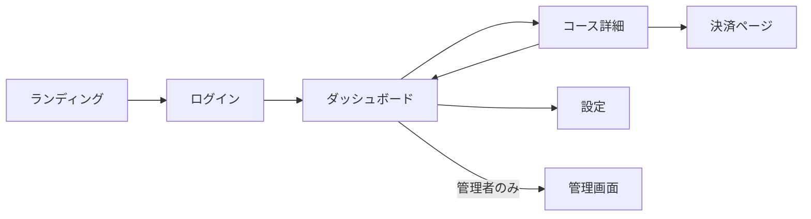

# DevForge v9 改善提案書 v2

> 作成日: 2026-02-10  
> 前提: Round 24完了（247テスト / 410KB / CAP-001,002 全解決済）

---

## 核心的な発見: 生成コンテンツの 91.5% が汎用テンプレート

LMS（学習管理システム）シナリオで生成された60ファイル/1,019行を計測した結果:

| 分類 | 行数 | 割合 |
|------|------|------|
| ドメイン固有の記述 | 87行 | **8.5%** |
| 汎用テンプレート（どのプロジェクトでも同じ） | 932行 | 91.5% |

つまり **ユーザーが10問の質問に答えた結果、9割以上が「どのプロジェクトにも出てくる同じ文面」**。
これが「生成AIにそのまま渡しても、AI側が具体的な設計判断を自力でやり直す必要がある」原因。

### 各機能の「設計深度」

| 機能 | 現状の出力 | AIが実装時に自力で決めること |
|------|-----------|--------------------------|
| ユーザー認証 | 名前が11箇所に出現 | ログインフロー、トークンリフレッシュ、パスワードリセット手順 |
| コース管理 | 名前が11箇所に出現 | 公開/下書き状態、講師と受講者の権限分離、検索/フィルタ仕様 |
| 進捗管理 | 名前が12箇所に出現 | 完了条件（動画視聴率?クイズ合格?）、進捗率の算出式 |
| サブスクリプション | 名前が10箇所に出現 | プラン設計、Webhook処理、解約フロー、ペイウォール条件 |
| 管理ダッシュボード | 名前が10箇所に出現 | 管理者ロール定義、RBACポリシー、監査ログ |

### エンティティの「カラム深度」

| エンティティ | 現状のカラム | 実用に必要なカラム |
|-------------|------------|------------------|
| User | id, name, created_at, updated_at | + email, avatar_url, role, stripe_customer_id |
| Course | id, user_id, name, created_at, updated_at | + description, price, status(draft/published), thumbnail_url, category_id |
| Lesson | id, course_id, name, created_at, updated_at | + order, content_type, duration_min, video_url, is_free |
| Progress | id, name, created_at, updated_at | **FK欠落** + user_id, lesson_id, status, completed_at, score |
| Enrollment | id, name, created_at, updated_at | **FK欠落** + user_id, course_id, enrolled_at, expires_at, status |

**Progress と Enrollment にFK（user_id, course_id）が生成されない** — inferER の中間テーブル表記
`"User 1 ──N Enrollment ──N Course"` のパーサがチェーン形式に未対応。

---

## 改善提案（効果の大きい順）

---

### 🔴 改善1: ドメイン知識に基づくエンティティカラム自動生成

**現状**: 全エンティティが `id / name / created_at / updated_at` の4カラム固定。
**改善**: エンティティ名からドメイン固有カラムを推論して生成。

```javascript
const ENTITY_COLUMNS = {
  User:        ['email:VARCHAR(255):UNIQUE:NOT NULL', 'avatar_url:TEXT', 'role:VARCHAR(20):DEFAULT user'],
  Course:      ['description:TEXT', 'price:DECIMAL(10,2)', 'status:VARCHAR(20):DEFAULT draft', 'thumbnail_url:TEXT', 'instructor_id:UUID:FK(User)'],
  Lesson:      ['sort_order:INT:DEFAULT 0', 'content_type:VARCHAR(20)', 'duration_min:INT', 'video_url:TEXT', 'is_free:BOOLEAN:DEFAULT false'],
  Progress:    ['user_id:UUID:FK(User):NOT NULL', 'lesson_id:UUID:FK(Lesson):NOT NULL', 'status:VARCHAR(20):DEFAULT not_started', 'completed_at:TIMESTAMP', 'score:INT'],
  Enrollment:  ['user_id:UUID:FK(User):NOT NULL', 'course_id:UUID:FK(Course):NOT NULL', 'enrolled_at:TIMESTAMP:DEFAULT NOW', 'expires_at:TIMESTAMP', 'status:VARCHAR(20):DEFAULT active'],
  Product:     ['description:TEXT', 'price:DECIMAL(10,2):NOT NULL', 'stock:INT:DEFAULT 0', 'sku:VARCHAR(100):UNIQUE', 'category_id:UUID:FK(Category)'],
  Order:       ['user_id:UUID:FK(User):NOT NULL', 'total:DECIMAL(10,2)', 'status:VARCHAR(20):DEFAULT pending', 'stripe_session_id:TEXT'],
  Post:        ['user_id:UUID:FK(User):NOT NULL', 'title:VARCHAR(255):NOT NULL', 'body:TEXT', 'status:VARCHAR(20):DEFAULT draft', 'published_at:TIMESTAMP'],
  Comment:     ['user_id:UUID:FK(User):NOT NULL', 'post_id:UUID:FK(Post):NOT NULL', 'body:TEXT:NOT NULL'],
  // ... 30+ entities
};
```

**効果**: 特化度が 8.5% → 推定 25-30% に向上。AIが「カラム設計から」やらなくてよくなる。
**影響**: common.js (カラムDB追加) + docs.js (ER図) + p1-sdd.js (tech-plan)
**工数**: 中（1セッション）

---

### 🔴 改善2: inferER 中間テーブル・チェーン形式のパーサ修正

**現状**: `"User 1 ──N Enrollment ──N Course"` → parser が `from=User, to=Course` と解釈。
Enrollment は FK を持たず、Progress は関係自体が推論されない。

**改善**: チェーン形式を分解し、中間テーブルにも FK を付与:
```
"User 1 ──N Enrollment ──N Course"
  → User ||--o{ Enrollment : "has"
  → Course ||--o{ Enrollment : "belongs to"
  → Enrollment gets user_id + course_id
```

また未カバーの関係を追加:
```javascript
if(has('User')&&has('Progress')) rels.push('User 1 ──N Progress');
if(has('Lesson')&&has('Progress')) rels.push('Lesson 1 ──N Progress');
if(has('User')&&has('Review')) rels.push('User 1 ──N Review');
if(has('Course')&&has('Review')) rels.push('Course 1 ──N Review');
```

**効果**: ER図とDB設計が実用レベルに。RLSポリシー例 `auth.uid() = user_id` が実際に機能する。
**工数**: 小

---

### 🔴 改善3: MVP機能の詳細仕様（受入条件）自動生成

**現状**: `- ユーザー認証` `- コース管理` — 名前だけのリスト。
**改善**: 機能名からドメイン知識を使って受入条件を展開:

```javascript
const FEATURE_DETAILS = {
  'ユーザー認証|認証|Auth': {
    criteria: ['メール+パスワードでの新規登録', 'ソーシャルログイン({auth})', 
               'パスワードリセットメール送信', 'セッション管理/自動リフレッシュ',
               'ログアウト後のトークン無効化'],
    screens: ['ログイン画面', '新規登録画面', 'パスワードリセット画面'],
  },
  'コース管理|コース|Course': {
    criteria: ['コース作成(タイトル/説明/サムネイル/価格)', 'コース一覧(検索/フィルタ/ページネーション)',
               'コース詳細表示', '下書き↔公開の状態管理', '講師のみ編集可能(RLS)'],
    screens: ['コース一覧', 'コース作成/編集', 'コース詳細'],
  },
  'サブスクリプション|課金|Billing|Stripe': {
    criteria: ['プラン選択画面(Free/Pro/Enterprise)', 'Stripe Checkout遷移',
               'Webhook処理(invoice.paid, customer.subscription.deleted)',
               '課金状態表示(アクティブ/期限切れ/解約済)', 'プラン変更/解約フロー'],
    screens: ['料金プラン画面', '決済完了画面', 'サブスクリプション管理'],
    db: ['stripe_customer_id on User', 'subscription_id/status/current_period_end on Subscription'],
  },
  // ...
};
```

specification.md に受入条件セクション、verification.md にテストケース展開。

**効果**: 「AIにそのまま投入して実装できる」度が飛躍的に向上。
**工数**: 中（辞書構築がメイン）

---

### 🟡 改善4: 決済（Stripe）統合設計の自動生成

**現状**: `| 決済 | Stripe |` が表に1行あるだけ。Webhook/状態DB/ペイウォール/プラン設計なし。
**改善**: `payment=Stripe` 選択時に自動生成:

| 生成先 | 追加内容 |
|--------|----------|
| specification.md | プラン表(Free/Pro/Enterprise)、価格、制限事項 |
| technical-plan.md | subscriptions テーブル、Webhook処理フロー図 |
| .env.example | STRIPE_SECRET_KEY, STRIPE_WEBHOOK_SECRET, STRIPE_PRICE_ID_* |
| docs/05_api_design.md | /api/webhook/stripe エンドポイント or Edge Function |
| package.json | stripe ^17 依存 |
| docs/08_security.md | Webhook署名検証、idempotency key |

**工数**: 中

---

### 🟡 改善5: ロール/RBAC設計の自動生成

**現状**: target に「管理者」があっても権限設計が出力されない。
**改善**: target検出 → 自動注入:

- profiles テーブルに role 列追加
- ロール定義表（user/instructor/admin）+ 各ロールのCRUD権限マトリクス
- RLS例: `auth.uid() = user_id AND role = 'admin'`
- CLAUDE.md に「管理者ルートは /admin/* に集約、admin role チェック必須」を追記

**工数**: 小

---

### 🟡 改善6: テストケースの機能固有化

**現状**: 全機能が同じ6ケース（正常基本操作/境界値/必須欠落/権限不足/不正フォーマット/ID不存在）。
**改善**: FEATURE_DETAILS辞書から機能固有テストケースを生成:

```
### コース管理
| # | ケース | 期待結果 |
|---|--------|----------|
| 1 | 正常系: コース作成(全フィールド入力) | 201, コースがDB保存 |
| 2 | 正常系: ステータス変更(draft→published) | 200, 公開日時記録 |
| 3 | 異常系: 未認証でコース作成 | 401 |
| 4 | 異常系: 他講師のコースを編集 | 403 (RLS) |
| 5 | 異常系: 価格が負数 | 422 |
| 6 | 境界値: タイトル255文字 | 200 |
```

**工数**: 中（FEATURE_DETAILS辞書との連携）

---

### 🟢 改善7: 画面遷移図のインテリジェント化

**現状**: `S0→S1→S2→S3→S4→S5` — 単なる直列チェーン。
**改善**: 画面名から遷移パターンを推論:

- ランディング → ログイン → ダッシュボード（認証フロー）
- ダッシュボード ←→ コース詳細 ←→ 設定（双方向遷移）
- 管理画面 ← ダッシュボード（管理者のみ）
- 決済ページ ← コース詳細（購入フロー）



**工数**: 中

---

### 🟢 改善8: CI/CD ワークフローファイル生成

**現状**: `.github/copilot-instructions.md` のみ。実行可能な `.yml` なし。
**改善**: deploy先別に生成:

- `.github/workflows/ci.yml` — lint → test → build（共通）
- `.github/workflows/deploy.yml` — Vercel/Netlify/Railway別の本番デプロイ
- `.github/workflows/preview.yml` — PR時のプレビューデプロイ

**工数**: 中

---

### 🟢 改善9: プリセット拡充（5種 → 10種）

**現状**: SaaS / EC / Community / Portfolio の4種。
**追加候補**:

| プリセット | エンティティ | 機能 |
|-----------|------------|------|
| 教育LMS | User, Course, Lesson, Progress, Quiz, Certificate | コース管理, 進捗, 修了証 |
| 医療/予約 | User, Patient, Doctor, Appointment, MedicalRecord | 予約管理, カルテ, 通知 |
| SaaS Admin | User, Workspace, Member, Plan, Invoice, AuditLog | マルチテナント, RBAC, 監査 |
| マーケットプレイス | User, Listing, Bid, Transaction, Review, Message | 出品, 取引, レビュー, DM |
| IoT Dashboard | User, Device, Sensor, Reading, Alert, Dashboard | リアルタイムデータ, アラート |
| ブログ/メディア | User, Post, Category, Tag, Comment, Media | CMS, SEO, メディア管理 |

**工数**: 小（presets.js に追加のみ。改善1のENTITY_COLUMNSと連動すると効果倍増）

---

### 🔵 改善10: 生成物のAI投入最適化

**現状**: 60ファイル / ~9,400トークンの全量コピーが必要。
**改善**:
- **コンパクトモード**: .spec/ 5文書だけの連結Markdown出力（~3,000トークン）
- **フェーズ別出力**: 「Sprint 0: 環境構築に必要な情報だけ」「Sprint 1: コア機能の仕様だけ」
- **Cursor最適化**: .cursorrules + CLAUDE.md を最優先で表示し、残りはリンク参照

**工数**: 中

---

## 推奨実施順

```
Round 25:  改善2 (inferERパーサ修正) + 改善1 (エンティティカラム辞書) 
           → DB設計・ER図の実用化
           
Round 26:  改善3 (機能受入条件) + 改善6 (テストケース固有化)
           → 仕様書の「中身」の充実
           
Round 27:  改善4 (Stripe統合) + 改善5 (RBAC)
           → 外部レビューP1残件の完全解消
           
Round 28:  改善7 (画面遷移) + 改善8 (CI/CD) + 改善9 (プリセット)
           → 周辺品質の向上
           
Round 29:  改善10 (AI投入最適化)
           → ユーザー体験の仕上げ
```

---

## 期待効果

| 指標 | 現状 | 改善1-3実施後 | 全改善後 |
|------|------|-------------|---------|
| ドメイン固有率 | 8.5% | ~30% | ~45% |
| エンティティカラム | 4列固定 | 7-12列/エンティティ | 同左 |
| 機能あたり記述量 | 名前のみ | 受入条件5-8項 | +テストケース固有化 |
| FK正確度 | ~60%（中間テーブル欠落） | 95%+ | 同左 |
| Stripe設計 | 名前だけ | Webhook+DB+プラン | 同左 |
| テストケース | 全機能同一6件 | 機能固有5-8件 | 同左 |
| 生成AIへの実用度 | 骨格のみ→AI任せ | 設計済→AI実装のみ | AI即実装可 |
